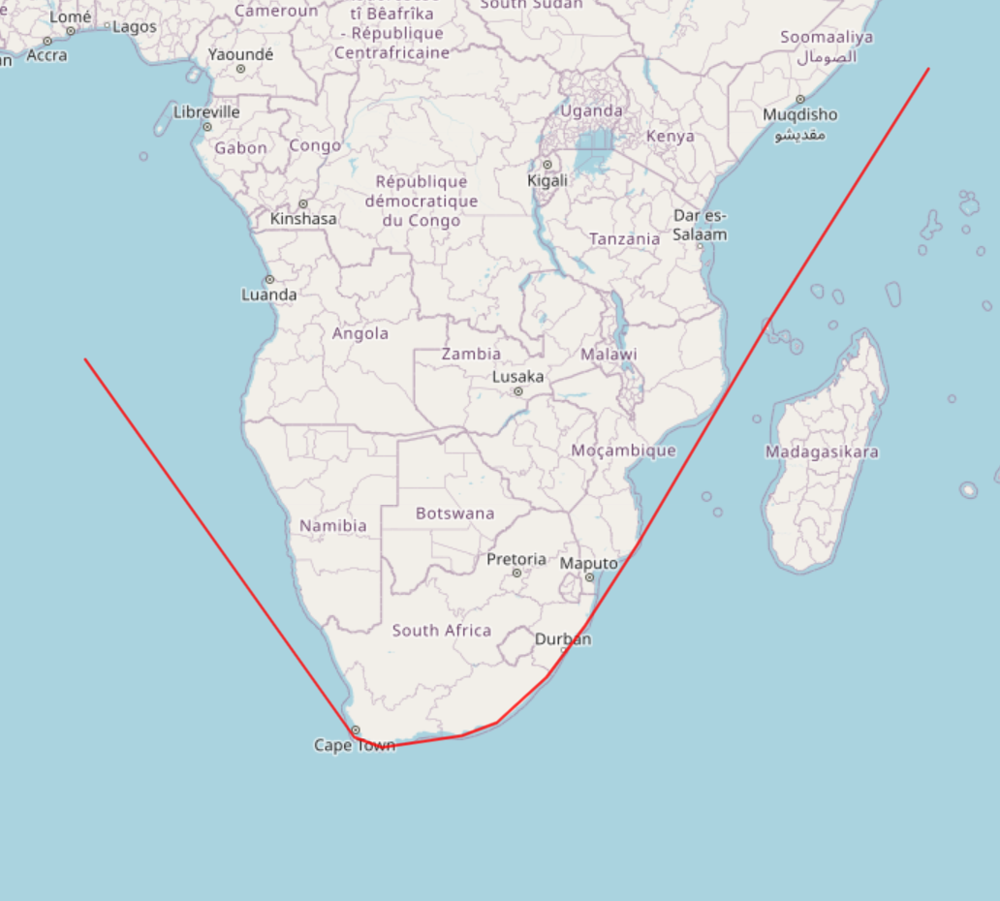

# Coast Aware Path Interpolator (CAPI)

## What is CAPI?

CAPI is a Python library which aims to provide sensible interpolations of paths around obstacles
represented as polygons. For instance, when we have two points in the path of a vessel, and we wish
to infer the ship's trajectory between them, we definitely do not want the inferred path to cross over land.
So, we take the shortest path which does not violate this constraint.

## How does CAPI Work?

CAPI comes with two parts. Firstly, a visibility graph generator, which turns a vector representation of all
the obstacles (such as a shapefile for countries), into a visibility graph. Secondly, CAPI comes with a path searcher,
which uses A* to traverse the generated visibility graph and come up with the sensible interpolation.

## Is CAPI fast?

That's up to you to decide. However, we have taken care to make CAPI as fast as it can be. The visibility graph
computation and shortest path calculation gruntwork are all implemented in C++. OpenMP is used to improve concurrency for
the visibility graph computation.

## C++ Dependencies

- OpenMP
- TBB (Thread Building Blocks)
- [S2Geometry](https://github.com/google/s2geometry) dependencies. `sudo apt install libgflags-dev libgoogle-glog-dev libgtest-dev libssl-dev git`
- [S2Geometry](https://github.com/google/s2geometry). The repo needs to be cloned at commit `git reset --hard 4c7cdae4eb7345fc8824c08af6b8d9581bf8febb` and built.

## CAPI History

- CAPI was created as a project for my work at Wisetech Global in 2021.
