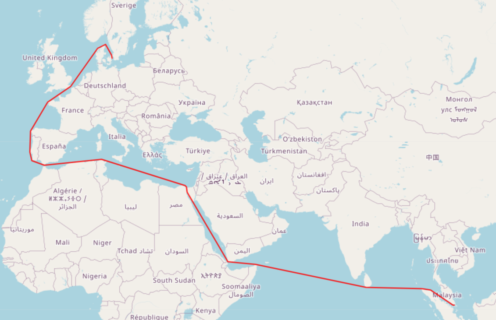

# Coast Aware Path Interpolator (CAPI)

## What is CAPI?

CAPI is a library which aims to provide sensible interpolations of paths around obstacles
represented as polygons. For instance, when we have two points in the path of a vessel, and we wish
to infer the ship's trajectory between them, we definitely do not want the inferred path to cross over land.
So, we take the shortest path which does not violate this constraint.

## How does CAPI Work?

CAPI comes with two parts. Firstly, a visibility graph generator, which turns a vector representation of all
the obstacles (such as a shapefile for countries), into a visibility graph. Secondly, CAPI comes with a path searcher,
which uses A* to traverse the generated visibility graph and come up with the sensible interpolation.
